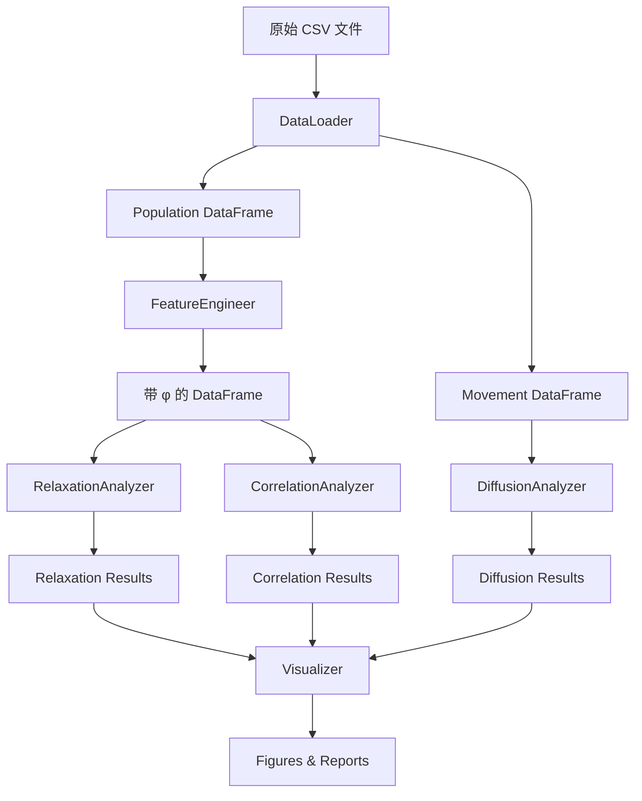

# 数据挖掘 Pipeline

> **项目**：Disaster Recovery Dynamics  
> **数据源**：Facebook Disaster Maps - Turkey Earthquake 2023  
> **目标**：从原始数据到可分析的特征提取

---

## 1. 数据概览

### 1.1 数据集基本信息

| 属性 | 值 |
|------|-----|
| **事件** | 2023年土耳其大地震（Mw 7.8）|
| **地震时间** | 2023年2月6日 04:17 (当地时间) |
| **数据时间范围** | 2023-02-05 至 2023-05-10（约3个月）|
| **时间分辨率** | 每8小时（00:00, 08:00, 16:00 PT）|
| **空间分辨率** | Bing Tile Level 14（约 2.4km × 2.4km）|

### 1.2 数据类型

| 数据类型 | 文件夹 | 记录数/文件 | 主要字段 |
|----------|--------|-------------|----------|
| **Population** | `population/` | ~30,000 行 | latitude, longitude, quadkey, n_baseline, n_crisis, z_score, percent_change |
| **Movement** | `movement/` | ~50,000 行 | start_lat/lon, end_lat/lon, length_km, n_baseline, n_crisis, z_score |
| **Network Coverage** | `network coverage/` | - | lat, lon, coverage, p_connectivity |
| **Business Activity** | `business activity/` | - | 待探索 |

### 1.3 关键字段说明

#### Population 数据

| 字段 | 含义 | 使用场景 |
|------|------|----------|
| `n_baseline` | 震前45天同时段平均人口 | 基准线 |
| `n_crisis` | 当前时段人口（含噪声） | 实际观测 |
| `z_score` | 标准化偏离 (clipped to [-4, 4]) | 异常检测 |
| `percent_change` | 百分比变化 | 相对变化 |
| `quadkey` | Bing tile 唯一标识 | 空间索引 |

#### Movement 数据

| 字段 | 含义 | 使用场景 |
|------|------|----------|
| `start_quadkey`, `end_quadkey` | 起止 tile | O-D 矩阵构建 |
| `length_km` | 移动距离 | 扩散分析 |
| `n_baseline`, `n_crisis` | 流量基准与实际 | 流动异常 |

---

## 2. Pipeline 架构

```
┌─────────────────────────────────────────────────────────────────┐
│                        原始数据 (Raw Data)                       │
│    population/*.csv  |  movement/*.csv  |  network/*.csv        │
└────────────────────────────┬────────────────────────────────────┘
                             │
                             ▼
┌─────────────────────────────────────────────────────────────────┐
│                    Stage 1: 数据加载与清洗                        │
│    - CSV 读取与合并                                              │
│    - 缺失值处理 (\N → NaN)                                       │
│    - 数据类型标准化                                               │
│    - 时间戳解析与时区转换                                          │
└────────────────────────────┬────────────────────────────────────┘
                             │
                             ▼
┌─────────────────────────────────────────────────────────────────┐
│                    Stage 2: 特征工程                             │
│    - Order parameter 计算 (φ = Δn/n_baseline)                   │
│    - 空间聚合 (tile → region)                                    │
│    - 时间序列构建                                                 │
│    - 震中距离计算                                                 │
└────────────────────────────┬────────────────────────────────────┘
                             │
                             ▼
┌─────────────────────────────────────────────────────────────────┐
│                    Stage 3: 分析模块                             │
│    ┌──────────────┐  ┌──────────────┐  ┌──────────────┐         │
│    │ Relaxation   │  │ Diffusion    │  │ Correlation  │         │
│    │ Analysis     │  │ Analysis     │  │ Analysis     │         │
│    └──────────────┘  └──────────────┘  └──────────────┘         │
└────────────────────────────┬────────────────────────────────────┘
                             │
                             ▼
┌─────────────────────────────────────────────────────────────────┐
│                    Stage 4: 可视化与输出                          │
│    - 时空热力图                                                   │
│    - Relaxation curves                                           │
│    - Scaling plots                                               │
│    - 统计检验结果                                                 │
└─────────────────────────────────────────────────────────────────┘
```

---

## 3. Stage 1: 数据加载与清洗

### 3.1 文件命名约定

```
{dataset_id}_{date}_{time}.csv
例如：2172754818300831_2023-02-06_0800.csv
```

### 3.2 加载脚本框架

```python
"""
data_loader.py - 数据加载模块
"""
import pandas as pd
import numpy as np
from pathlib import Path
from datetime import datetime
import pytz

class DisasterDataLoader:
    """Facebook Disaster Maps 数据加载器"""
    
    def __init__(self, data_root: str):
        self.data_root = Path(data_root)
        self.earthquake_time = datetime(2023, 2, 6, 4, 17, tzinfo=pytz.timezone('Europe/Istanbul'))
    
    def load_population(self, start_date: str = None, end_date: str = None) -> pd.DataFrame:
        """
        加载人口数据
        
        Returns:
            DataFrame with columns: datetime, quadkey, lat, lon, 
                                   n_baseline, n_crisis, z_score, percent_change
        """
        pop_dir = self.data_root / "population"
        dfs = []
        
        for f in sorted(pop_dir.glob("*.csv")):
            df = pd.read_csv(f, na_values=['\\N', ''])
            # 解析文件名获取时间
            parts = f.stem.split('_')
            date_str = parts[1]
            time_str = parts[2]
            df['datetime'] = pd.to_datetime(f"{date_str} {time_str[:2]}:00")
            dfs.append(df)
        
        result = pd.concat(dfs, ignore_index=True)
        return self._clean_population(result)
    
    def load_movement(self, start_date: str = None, end_date: str = None) -> pd.DataFrame:
        """加载流动数据"""
        mov_dir = self.data_root / "movement"
        dfs = []
        
        for f in sorted(mov_dir.glob("*.csv")):
            df = pd.read_csv(f, na_values=['\\N', ''])
            parts = f.stem.split('_')
            date_str = parts[1]
            time_str = parts[2]
            df['datetime'] = pd.to_datetime(f"{date_str} {time_str[:2]}:00")
            dfs.append(df)
        
        result = pd.concat(dfs, ignore_index=True)
        return self._clean_movement(result)
    
    def _clean_population(self, df: pd.DataFrame) -> pd.DataFrame:
        """清洗人口数据"""
        # 重命名列
        df = df.rename(columns={
            'latitude': 'lat',
            'longitude': 'lon'
        })
        
        # 确保数值类型
        numeric_cols = ['n_baseline', 'n_crisis', 'z_score', 'percent_change']
        for col in numeric_cols:
            if col in df.columns:
                df[col] = pd.to_numeric(df[col], errors='coerce')
        
        # 计算震后时间（小时）
        df['hours_since_quake'] = (df['datetime'] - self.earthquake_time).dt.total_seconds() / 3600
        
        return df
    
    def _clean_movement(self, df: pd.DataFrame) -> pd.DataFrame:
        """清洗流动数据"""
        # 确保数值类型
        numeric_cols = ['n_baseline', 'n_crisis', 'z_score', 'percent_change', 'length_km']
        for col in numeric_cols:
            if col in df.columns:
                df[col] = pd.to_numeric(df[col], errors='coerce')
        
        # 计算震后时间
        df['hours_since_quake'] = (df['datetime'] - self.earthquake_time).dt.total_seconds() / 3600
        
        return df
```

### 3.3 缺失值处理策略

| 情况 | 处理方式 | 理由 |
|------|----------|------|
| `n_baseline` 或 `n_crisis` < 10 | 保留 NaN | 隐私保护导致的缺失 |
| 派生统计量缺失 | 不补值 | 无法可靠估计 |
| 时间序列缺口 | 标记但不插值 | 保持数据真实性 |

---

## 4. Stage 2: 特征工程

### 4.1 Order Parameter 计算

```python
"""
feature_engineering.py - 特征工程模块
"""
import numpy as np
import pandas as pd
from scipy.spatial.distance import cdist

class FeatureEngineer:
    """特征工程类"""
    
    # 震中坐标 (2023土耳其地震)
    EPICENTER = (37.174, 37.032)  # (lat, lon)
    
    def compute_order_parameter(self, df: pd.DataFrame) -> pd.DataFrame:
        """
        计算 order parameter φ = (n_crisis - n_baseline) / n_baseline
        
        处理边界情况：
        - n_baseline = 0: 使用 z_score 代替
        - n_baseline 很小: 使用正则化
        """
        df = df.copy()
        
        # 基础 order parameter
        epsilon = 1.0  # 正则化参数，与 Facebook 文档一致
        df['phi'] = (df['n_crisis'] - df['n_baseline']) / (df['n_baseline'] + epsilon)
        
        # 标准化版本（使用 z_score）
        df['phi_z'] = df['z_score']
        
        return df
    
    def compute_distance_to_epicenter(self, df: pd.DataFrame) -> pd.DataFrame:
        """计算每个 tile 到震中的距离（km）"""
        df = df.copy()
        
        # Haversine 公式
        def haversine(lat1, lon1, lat2, lon2):
            R = 6371  # 地球半径 km
            lat1, lon1, lat2, lon2 = map(np.radians, [lat1, lon1, lat2, lon2])
            dlat = lat2 - lat1
            dlon = lon2 - lon1
            a = np.sin(dlat/2)**2 + np.cos(lat1) * np.cos(lat2) * np.sin(dlon/2)**2
            return 2 * R * np.arcsin(np.sqrt(a))
        
        df['dist_to_epicenter'] = haversine(
            df['lat'], df['lon'], 
            self.EPICENTER[0], self.EPICENTER[1]
        )
        
        return df
    
    def bin_by_distance(self, df: pd.DataFrame, bins: list = None) -> pd.DataFrame:
        """按震中距离分箱"""
        if bins is None:
            bins = [0, 50, 100, 200, 500, 1000, np.inf]
        
        labels = [f"{bins[i]}-{bins[i+1]}km" for i in range(len(bins)-1)]
        df['distance_bin'] = pd.cut(df['dist_to_epicenter'], bins=bins, labels=labels)
        
        return df
    
    def aggregate_by_time(self, df: pd.DataFrame, 
                          group_col: str = 'distance_bin') -> pd.DataFrame:
        """
        按时间和分组聚合
        
        Returns:
            时间序列 DataFrame，每个时间点每个分组一行
        """
        agg_df = df.groupby(['datetime', 'hours_since_quake', group_col]).agg({
            'phi': ['mean', 'std', 'count'],
            'phi_z': ['mean', 'std'],
            'n_crisis': 'sum',
            'n_baseline': 'sum'
        }).reset_index()
        
        # 展平列名
        agg_df.columns = ['_'.join(col).strip('_') for col in agg_df.columns]
        
        return agg_df
```

### 4.2 时间序列构建

```python
def build_relaxation_timeseries(df: pd.DataFrame, 
                                 tile_ids: list = None) -> pd.DataFrame:
    """
    构建 relaxation 时间序列
    
    对于每个 tile（或 tile 组），计算：
    - φ(t): order parameter 随时间的演化
    - 归一化 φ(t)/φ(0): 便于比较不同区域
    """
    if tile_ids is not None:
        df = df[df['quadkey'].isin(tile_ids)]
    
    # 按时间排序
    df = df.sort_values('datetime')
    
    # 找到初始偏离（震后第一个时间点）
    t0_mask = df['hours_since_quake'] > 0
    t0_data = df[t0_mask].groupby('quadkey')['phi'].first()
    
    # 归一化
    df['phi_normalized'] = df.apply(
        lambda row: row['phi'] / t0_data.get(row['quadkey'], np.nan) 
        if row['quadkey'] in t0_data.index else np.nan,
        axis=1
    )
    
    return df
```

---

## 5. Stage 3: 分析模块

### 5.1 Relaxation Analysis

```python
"""
relaxation_analysis.py - 弛豫动力学分析
"""
import numpy as np
from scipy.optimize import curve_fit
from scipy.stats import ks_2samp
import warnings

class RelaxationAnalyzer:
    """弛豫曲线分析"""
    
    @staticmethod
    def exponential(t, tau, A, C):
        """指数弛豫：φ(t) = A * exp(-t/τ) + C"""
        return A * np.exp(-t / tau) + C
    
    @staticmethod
    def power_law(t, alpha, A, C):
        """幂律弛豫：φ(t) = A * t^(-α) + C"""
        return A * np.power(t + 1, -alpha) + C  # +1 避免 t=0 奇点
    
    @staticmethod
    def stretched_exp(t, tau, beta, A, C):
        """Stretched exponential：φ(t) = A * exp(-(t/τ)^β) + C"""
        return A * np.exp(-np.power(t / tau, beta)) + C
    
    def fit_all_models(self, t: np.ndarray, phi: np.ndarray) -> dict:
        """
        拟合所有候选模型并比较
        
        Returns:
            dict with model name -> {params, residual, AIC, BIC}
        """
        results = {}
        n = len(t)
        
        # 过滤有效数据
        mask = ~np.isnan(phi) & ~np.isnan(t) & (t > 0)
        t_valid = t[mask]
        phi_valid = phi[mask]
        
        if len(t_valid) < 10:
            return results
        
        # 指数模型
        try:
            popt, pcov = curve_fit(
                self.exponential, t_valid, phi_valid,
                p0=[24, phi_valid[0], 0],
                bounds=([0.1, -np.inf, -np.inf], [1000, np.inf, np.inf]),
                maxfev=5000
            )
            residual = np.sum((phi_valid - self.exponential(t_valid, *popt))**2)
            k = 3
            aic = n * np.log(residual/n) + 2*k
            bic = n * np.log(residual/n) + k*np.log(n)
            results['exponential'] = {
                'params': {'tau': popt[0], 'A': popt[1], 'C': popt[2]},
                'residual': residual,
                'AIC': aic,
                'BIC': bic
            }
        except Exception as e:
            warnings.warn(f"Exponential fit failed: {e}")
        
        # 幂律模型
        try:
            popt, pcov = curve_fit(
                self.power_law, t_valid, phi_valid,
                p0=[0.5, phi_valid[0], 0],
                bounds=([0.01, -np.inf, -np.inf], [3, np.inf, np.inf]),
                maxfev=5000
            )
            residual = np.sum((phi_valid - self.power_law(t_valid, *popt))**2)
            k = 3
            aic = n * np.log(residual/n) + 2*k
            bic = n * np.log(residual/n) + k*np.log(n)
            results['power_law'] = {
                'params': {'alpha': popt[0], 'A': popt[1], 'C': popt[2]},
                'residual': residual,
                'AIC': aic,
                'BIC': bic
            }
        except Exception as e:
            warnings.warn(f"Power law fit failed: {e}")
        
        # Stretched exponential
        try:
            popt, pcov = curve_fit(
                self.stretched_exp, t_valid, phi_valid,
                p0=[24, 0.5, phi_valid[0], 0],
                bounds=([0.1, 0.1, -np.inf, -np.inf], [1000, 2, np.inf, np.inf]),
                maxfev=5000
            )
            residual = np.sum((phi_valid - self.stretched_exp(t_valid, *popt))**2)
            k = 4
            aic = n * np.log(residual/n) + 2*k
            bic = n * np.log(residual/n) + k*np.log(n)
            results['stretched_exp'] = {
                'params': {'tau': popt[0], 'beta': popt[1], 'A': popt[2], 'C': popt[3]},
                'residual': residual,
                'AIC': aic,
                'BIC': bic
            }
        except Exception as e:
            warnings.warn(f"Stretched exp fit failed: {e}")
        
        return results
    
    def select_best_model(self, results: dict, criterion: str = 'BIC') -> str:
        """选择最优模型"""
        if not results:
            return None
        return min(results.keys(), key=lambda k: results[k][criterion])
```

### 5.2 Diffusion Analysis

```python
"""
diffusion_analysis.py - 扩散分析
"""
import numpy as np
import pandas as pd
from collections import defaultdict

class DiffusionAnalyzer:
    """反常扩散分析"""
    
    def compute_msd_from_movement(self, movement_df: pd.DataFrame, 
                                   time_lags: list = None) -> pd.DataFrame:
        """
        从 movement 数据计算 Mean Square Displacement
        
        注意：这不是追踪单个个体，而是基于群体流动距离分布
        """
        if time_lags is None:
            time_lags = [8, 16, 24, 48, 72, 96, 120, 168]  # 小时
        
        results = []
        
        for lag in time_lags:
            # 筛选对应时间段的流动
            # 由于数据是8小时窗口，lag需要是8的倍数
            n_windows = lag // 8
            
            # 计算该时间尺度的平均位移
            subset = movement_df[movement_df['hours_since_quake'] > 0]
            
            # 加权平均位移平方
            if 'n_crisis' in subset.columns and 'length_km' in subset.columns:
                valid = subset.dropna(subset=['n_crisis', 'length_km'])
                if len(valid) > 0:
                    msd = np.average(valid['length_km']**2, weights=valid['n_crisis'])
                    std = np.sqrt(np.average((valid['length_km']**2 - msd)**2, 
                                            weights=valid['n_crisis']))
                    results.append({
                        'time_lag_hours': lag,
                        'msd': msd,
                        'msd_std': std,
                        'n_samples': len(valid)
                    })
        
        return pd.DataFrame(results)
    
    def fit_anomalous_exponent(self, msd_df: pd.DataFrame) -> dict:
        """
        拟合 MSD ~ t^γ
        
        Returns:
            {'gamma': float, 'D_eff': float, 'r_squared': float}
        """
        from scipy.stats import linregress
        
        valid = msd_df.dropna()
        if len(valid) < 3:
            return None
        
        log_t = np.log(valid['time_lag_hours'])
        log_msd = np.log(valid['msd'])
        
        slope, intercept, r_value, p_value, std_err = linregress(log_t, log_msd)
        
        return {
            'gamma': slope,
            'gamma_std': std_err,
            'D_eff': np.exp(intercept),
            'r_squared': r_value**2,
            'p_value': p_value
        }
    
    def compute_displacement_distribution(self, movement_df: pd.DataFrame,
                                          time_window: tuple = None) -> pd.DataFrame:
        """
        计算位移分布 P(r)
        
        检验是否为 Lévy flight（重尾分布）
        """
        if time_window:
            df = movement_df[
                (movement_df['hours_since_quake'] >= time_window[0]) &
                (movement_df['hours_since_quake'] < time_window[1])
            ]
        else:
            df = movement_df
        
        # 加权直方图
        r = df['length_km'].dropna()
        weights = df.loc[r.index, 'n_crisis'].fillna(1)
        
        # 对数 binning
        bins = np.logspace(np.log10(0.1), np.log10(r.max()), 50)
        hist, bin_edges = np.histogram(r, bins=bins, weights=weights, density=True)
        
        bin_centers = np.sqrt(bin_edges[:-1] * bin_edges[1:])  # 几何平均
        
        return pd.DataFrame({
            'r': bin_centers,
            'P_r': hist
        })
```

### 5.3 Correlation Analysis

```python
"""
correlation_analysis.py - 时空关联分析
"""
import numpy as np
import pandas as pd
from scipy.spatial.distance import pdist, squareform

class CorrelationAnalyzer:
    """时空关联函数分析"""
    
    def compute_spatial_correlation(self, df: pd.DataFrame, 
                                     time_point: str,
                                     max_dist: float = 500) -> pd.DataFrame:
        """
        计算空间关联函数 C(r) = <φ(x)φ(x+r)>
        
        Args:
            df: 包含 lat, lon, phi 的 DataFrame
            time_point: 时间点
            max_dist: 最大距离 (km)
        """
        # 筛选时间点
        snapshot = df[df['datetime'] == time_point].copy()
        
        if len(snapshot) < 10:
            return pd.DataFrame()
        
        # 计算距离矩阵
        coords = snapshot[['lat', 'lon']].values
        # 简化：使用欧氏距离近似（小范围内可接受）
        # 更精确应该用 Haversine
        dist_matrix = squareform(pdist(coords)) * 111  # 度 → km 近似
        
        # 计算相关
        phi = snapshot['phi'].values
        phi_centered = phi - np.nanmean(phi)
        
        # 按距离 bin
        bins = np.linspace(0, max_dist, 50)
        correlations = []
        
        for i in range(len(bins) - 1):
            mask = (dist_matrix >= bins[i]) & (dist_matrix < bins[i+1])
            if mask.sum() > 0:
                # C(r) = <φ_i φ_j> for |r_i - r_j| in [bin_i, bin_i+1]
                pairs = []
                for idx in range(len(phi)):
                    for jdx in range(idx+1, len(phi)):
                        if mask[idx, jdx]:
                            pairs.append(phi_centered[idx] * phi_centered[jdx])
                
                if pairs:
                    correlations.append({
                        'r': (bins[i] + bins[i+1]) / 2,
                        'C_r': np.mean(pairs),
                        'C_r_std': np.std(pairs) / np.sqrt(len(pairs)),
                        'n_pairs': len(pairs)
                    })
        
        return pd.DataFrame(correlations)
    
    def extract_correlation_length(self, corr_df: pd.DataFrame) -> dict:
        """
        提取关联长度 ξ
        
        假设 C(r) ~ exp(-r/ξ)
        """
        from scipy.optimize import curve_fit
        
        valid = corr_df[corr_df['C_r'] > 0].copy()
        if len(valid) < 5:
            return None
        
        def exp_decay(r, xi, A):
            return A * np.exp(-r / xi)
        
        try:
            popt, pcov = curve_fit(
                exp_decay, 
                valid['r'].values, 
                valid['C_r'].values,
                p0=[50, valid['C_r'].iloc[0]],
                bounds=([1, 0], [1000, np.inf])
            )
            return {
                'xi': popt[0],
                'amplitude': popt[1],
                'xi_std': np.sqrt(pcov[0, 0])
            }
        except:
            return None
    
    def correlation_length_vs_time(self, df: pd.DataFrame) -> pd.DataFrame:
        """
        计算关联长度随时间的演化 ξ(t)
        
        检验是否有 critical slowing down
        """
        time_points = df['datetime'].unique()
        results = []
        
        for t in sorted(time_points):
            corr = self.compute_spatial_correlation(df, t)
            xi_result = self.extract_correlation_length(corr)
            
            if xi_result:
                hours = df[df['datetime'] == t]['hours_since_quake'].iloc[0]
                results.append({
                    'datetime': t,
                    'hours_since_quake': hours,
                    'xi': xi_result['xi'],
                    'xi_std': xi_result['xi_std']
                })
        
        return pd.DataFrame(results)
```

---

## 6. Stage 4: 可视化

### 6.1 核心可视化函数

```python
"""
visualization.py - 可视化模块
"""
import matplotlib.pyplot as plt
import matplotlib.colors as mcolors
import numpy as np
import pandas as pd

# 设置中文字体
plt.rcParams['font.sans-serif'] = ['SimHei', 'DejaVu Sans']
plt.rcParams['axes.unicode_minus'] = False

class DisasterVisualizer:
    """灾难数据可视化"""
    
    def __init__(self, figsize=(12, 8), dpi=150):
        self.figsize = figsize
        self.dpi = dpi
        self.colors = plt.cm.viridis
    
    def plot_zscore_heatmap(self, df: pd.DataFrame, 
                            time_point: str = None,
                            ax=None) -> plt.Figure:
        """
        绘制 z_score 空间热力图
        """
        if ax is None:
            fig, ax = plt.subplots(figsize=self.figsize, dpi=self.dpi)
        else:
            fig = ax.figure
        
        if time_point:
            data = df[df['datetime'] == time_point]
            title = f"Z-score Heatmap @ {time_point}"
        else:
            data = df
            title = "Z-score Heatmap (all time)"
        
        scatter = ax.scatter(
            data['lon'], data['lat'],
            c=data['z_score'],
            cmap='RdBu_r',
            vmin=-4, vmax=4,
            s=1,
            alpha=0.7
        )
        
        plt.colorbar(scatter, ax=ax, label='z_score')
        ax.set_xlabel('Longitude')
        ax.set_ylabel('Latitude')
        ax.set_title(title)
        
        # 标记震中
        ax.scatter(37.032, 37.174, c='gold', s=200, marker='*', 
                  edgecolors='black', linewidths=1, label='Epicenter', zorder=5)
        ax.legend()
        
        return fig
    
    def plot_relaxation_curves(self, 
                               time_series: pd.DataFrame,
                               group_col: str = 'distance_bin',
                               fit_results: dict = None,
                               ax=None) -> plt.Figure:
        """
        绘制 relaxation 曲线
        """
        if ax is None:
            fig, ax = plt.subplots(figsize=self.figsize, dpi=self.dpi)
        else:
            fig = ax.figure
        
        groups = time_series[group_col].unique()
        colors = plt.cm.viridis(np.linspace(0, 1, len(groups)))
        
        for group, color in zip(groups, colors):
            subset = time_series[time_series[group_col] == group]
            ax.errorbar(
                subset['hours_since_quake'],
                subset['phi_mean'],
                yerr=subset['phi_std'] / np.sqrt(subset['phi_count']),
                label=group,
                color=color,
                fmt='o-',
                markersize=3,
                capsize=2,
                alpha=0.8
            )
        
        ax.axhline(0, color='gray', linestyle='--', alpha=0.5)
        ax.axvline(0, color='red', linestyle='--', alpha=0.5, label='Earthquake')
        
        ax.set_xlabel('Hours since earthquake')
        ax.set_ylabel('Order parameter φ')
        ax.set_title('Relaxation Dynamics by Distance to Epicenter')
        ax.legend(title=group_col, bbox_to_anchor=(1.05, 1), loc='upper left')
        
        plt.tight_layout()
        return fig
    
    def plot_msd(self, msd_df: pd.DataFrame, 
                 fit_params: dict = None,
                 ax=None) -> plt.Figure:
        """
        绘制 Mean Square Displacement (log-log)
        """
        if ax is None:
            fig, ax = plt.subplots(figsize=(8, 6), dpi=self.dpi)
        else:
            fig = ax.figure
        
        ax.errorbar(
            msd_df['time_lag_hours'],
            msd_df['msd'],
            yerr=msd_df['msd_std'],
            fmt='o',
            capsize=3,
            label='Data'
        )
        
        if fit_params and 'gamma' in fit_params:
            t = np.linspace(msd_df['time_lag_hours'].min(), 
                           msd_df['time_lag_hours'].max(), 100)
            msd_fit = fit_params['D_eff'] * t**fit_params['gamma']
            ax.plot(t, msd_fit, 'r--', 
                   label=f"Fit: γ = {fit_params['gamma']:.2f}")
        
        # 参考线
        t_ref = np.array([10, 200])
        ax.plot(t_ref, t_ref, 'k:', alpha=0.3, label='γ = 1 (normal)')
        ax.plot(t_ref, t_ref**0.5, 'g:', alpha=0.3, label='γ = 0.5 (subdiffusion)')
        ax.plot(t_ref, t_ref**1.5, 'b:', alpha=0.3, label='γ = 1.5 (superdiffusion)')
        
        ax.set_xscale('log')
        ax.set_yscale('log')
        ax.set_xlabel('Time lag (hours)')
        ax.set_ylabel('MSD (km²)')
        ax.set_title('Mean Square Displacement')
        ax.legend()
        
        return fig
    
    def plot_correlation_function(self, corr_df: pd.DataFrame,
                                   xi: float = None,
                                   ax=None) -> plt.Figure:
        """
        绘制空间关联函数 C(r)
        """
        if ax is None:
            fig, ax = plt.subplots(figsize=(8, 6), dpi=self.dpi)
        else:
            fig = ax.figure
        
        ax.errorbar(
            corr_df['r'],
            corr_df['C_r'],
            yerr=corr_df['C_r_std'],
            fmt='o',
            capsize=2
        )
        
        if xi:
            r = np.linspace(1, corr_df['r'].max(), 100)
            ax.plot(r, corr_df['C_r'].iloc[0] * np.exp(-r/xi), 
                   'r--', label=f'ξ = {xi:.1f} km')
        
        ax.set_xlabel('Distance r (km)')
        ax.set_ylabel('C(r)')
        ax.set_title('Spatial Correlation Function')
        ax.legend()
        
        return fig
```

---

## 7. 执行顺序与依赖



---

## 8. 快速开始脚本

```python
"""
main_analysis.py - 主分析脚本
"""
from pathlib import Path

# 配置
DATA_ROOT = Path("Data/Turkiye Turkey Earthquake Full Country Version Feb 8 2023")
OUTPUT_DIR = Path("output")
OUTPUT_DIR.mkdir(exist_ok=True)

def main():
    # 1. 加载数据
    print("Loading data...")
    loader = DisasterDataLoader(DATA_ROOT)
    pop_df = loader.load_population()
    mov_df = loader.load_movement()
    print(f"Population: {len(pop_df)} rows, Movement: {len(mov_df)} rows")
    
    # 2. 特征工程
    print("Feature engineering...")
    fe = FeatureEngineer()
    pop_df = fe.compute_order_parameter(pop_df)
    pop_df = fe.compute_distance_to_epicenter(pop_df)
    pop_df = fe.bin_by_distance(pop_df)
    
    # 3. 聚合时间序列
    print("Aggregating time series...")
    ts = fe.aggregate_by_time(pop_df, group_col='distance_bin')
    
    # 4. Relaxation 分析
    print("Relaxation analysis...")
    ra = RelaxationAnalyzer()
    # 对每个距离组做拟合
    for group in ts['distance_bin'].unique():
        subset = ts[ts['distance_bin'] == group]
        t = subset['hours_since_quake'].values
        phi = subset['phi_mean'].values
        results = ra.fit_all_models(t[t > 0], phi[t > 0])
        best = ra.select_best_model(results)
        print(f"  {group}: Best model = {best}")
    
    # 5. 可视化
    print("Creating visualizations...")
    viz = DisasterVisualizer()
    
    # Z-score heatmap (震后第一个时间点)
    first_time = pop_df[pop_df['hours_since_quake'] > 0]['datetime'].min()
    fig = viz.plot_zscore_heatmap(pop_df, time_point=str(first_time))
    fig.savefig(OUTPUT_DIR / "zscore_heatmap.png", bbox_inches='tight')
    
    # Relaxation curves
    fig = viz.plot_relaxation_curves(ts)
    fig.savefig(OUTPUT_DIR / "relaxation_curves.png", bbox_inches='tight')
    
    print("Done! Check output/ folder for results.")

if __name__ == "__main__":
    main()
```

---

## 9. 环境依赖

```
# requirements.txt
pandas>=1.5.0
numpy>=1.23.0
scipy>=1.10.0
matplotlib>=3.6.0
pytz>=2022.7
```

---

*文档版本：v1.0*  
*创建日期：2026-01-29*  
*最后更新：2026-01-29*
