下面是基于你给出的检索清单（重点覆盖 2023–2026，经典文献不限年份）做出的“分主题文献检索与梳理结果”，并按你提供的模板输出为 Markdown。由于你后续要做定位与 gap 识别，我把“最关键、最像竞争工作/最能支撑可行性”的文献放在「核心文献（必读）」里；其余放在「重要参考」与「经典理论」。

---

## 核心文献（必读，20 篇左右）

### [C01] Facebook Disaster Maps: Aggregate Insights for Crisis Response & Recovery

**基本信息：**

* 作者：Maas, P. 等
* 期刊/会议：KDD (ACM SIGKDD)
* 年份：2019
* DOI/链接：10.1145/3292500.3340412（ACM DL） ([ACM Digital Library][1])

**核心内容：**

* 研究问题：如何用 Facebook 的隐私保护聚合数据在灾害后快速生成可操作的人口变化与流动洞察，用于救援与恢复。 ([research.facebook.com][2])
* 使用数据：Facebook Disaster Maps（包含人口密度/人口变化、移动 OD 等聚合产品）。 ([research.facebook.com][2])
* 核心方法：以时空聚合、基线对照、隐私保护（去标识/聚合阈值等）为核心的数据产品化流程。 ([research.facebook.com][2])
* 主要发现：该类聚合产品可在传统统计/实地信息不足时提供近实时的人口变化与迁移趋势，为应急与资源调度提供补充。 ([research.facebook.com][2])

**与本研究关系：**

* 可借鉴：数据产品结构（Population/Density/Movement）、基线构造、隐私与偏差讨论框架。 ([research.facebook.com][2])
* 差异点：原文更偏“数据产品与人道应用”，不以“统计物理的普适标度/弛豫类”作为中心科学问题。 ([research.facebook.com][2])
* 我们的潜在创新：把 Disaster Maps 明确映射到“非平衡弛豫/扩散/相变”框架，定义 order parameter 与临界/标度量并做跨地区、跨事件的普适性检验。

**关键图/表：**

* （建议：重点找数据产品流程/基线定义/隐私阈值相关示意图；具体 Fig 编号需通读全文确认）

**引用价值：** ⭐⭐⭐⭐⭐

---

### [C02] Facebook Movement During Crisis (Meta AI for Good Dataset)

**基本信息：**

* 作者：Meta (Data for Good / AI for Good)
* 载体：数据集文档页（Dataset Documentation）
* 年份：持续维护（面向研究/人道机构）
* DOI/链接：Meta “Movement During Crisis” 数据集说明页 ([AI Meta][3])

**核心内容：**

* 研究问题：提供危机期间聚合 OD（从区域 i 到 j 的迁移量/迁移率等），支持应急响应与研究。 ([AI Meta][3])
* 使用数据：开启定位服务的 Facebook 用户的聚合流动统计。 ([AI Meta][3])
* 核心方法：空间网格/行政区聚合、时间窗聚合、隐私保护发布。 ([AI Meta][3])
* 主要发现：作为数据源，本身不提供论文式结论，但定义了你研究中最关键的观测量与空间/时间分辨率边界。 ([AI Meta][3])

**与本研究关系：**

* 可借鉴：变量定义（OD、相对变化）、空间层级、可用时间窗与限制（如代表性）。
* 差异点：数据集本身不回答“普适标度/弛豫机制”。
* 我们的潜在创新：围绕该数据集构造“恢复动力学的 order parameter”，并与地震强度/空间距离/城市规模建立标度关系。

**关键图/表：**

* 以数据字典/字段说明为主（无传统 Fig）

**引用价值：** ⭐⭐⭐⭐⭐（对你这个项目属于“数据可行性基石”）

---

### [C03] Patterns of population displacement during mega-fires in California detected using Facebook Disaster Maps

**基本信息：**

* 作者：Jia, S. 等
* 期刊：Environmental Research Letters
* 年份：2020
* DOI/链接：10.1088/1748-9326/ab8847 ([lcluc.umd.edu][4])

**核心内容：**

* 研究问题：Facebook Disaster Maps 是否能捕捉野火疏散/人口迁移时空模式？数据代表性如何？ ([Digital Commons][5])
* 使用数据：Facebook Disaster Maps（加州两次 mega-fires），并对照其他人口数据源做代表性评估。 ([Digital Commons][5])
* 核心方法：用趋势检验、异常/热点分析等刻画人口变化与聚集；评估不同人群代表性偏差。 ([Digital Commons][5])
* 主要发现：FBDM 可有效反映随疏散令发布/解除而产生的人口变化；但存在人群使用差异导致的代表性问题（例如老年群体可能低估）。 ([ResearchGate][6])

**与本研究关系：**

* 可借鉴：把“政策/事件时间点（如疏散令）→ 人口变化曲线”作为动力学输入；代表性评估思路。 ([ResearchGate][6])
* 差异点：研究对象是野火（疏散主导），你是地震（震后迁移 + 恢复）。
* 我们的潜在创新：把“人口变化曲线”进一步提升为弛豫模型拟合（指数/拉伸指数/幂律）与标度分析，并检验跨灾种普适性。

**关键图/表：**

* （建议：重点找“人口变化时间序列 + 疏散令时间点叠加”的核心图；Fig 编号需通读确认）

**引用价值：** ⭐⭐⭐⭐⭐

---

### [C04] Human mobility under disasters: a systematic review and framework for equitable and resilient mobility governance

**基本信息：**

* 作者：Huang, F. 等
* 期刊：npj Natural Hazards
* 年份：2025
* DOI/链接：期刊页面（Nature/npj） ([Nature][7])

**核心内容：**

* 研究问题：灾害情境下的人类流动研究走到哪里了？数据、方法、治理与公平性如何系统化？ ([Nature][7])
* 使用数据：系统综述覆盖手机信令、社交媒体、平台数据（含 Facebook Disaster Maps）、交通与遥感等。 ([Nature][7])
* 核心方法：综述与框架化总结（研究主题、方法谱系、治理/公平视角）。 ([Nature][7])
* 主要发现：灾害流动研究大量集中在“响应/疏散”与“韧性/不平等”，对“跨事件普适的恢复标度律”仍缺乏一致定义与检验路径（综述也强调治理与数据偏差挑战）。 ([Nature][7])

**与本研究关系：**

* 可借鉴：把你的研究放入“灾害流动—韧性—公平”总体图谱；快速定位可比数据与典型指标。 ([Nature][7])
* 差异点：综述不替代你要做的“统计物理定量建模与普适类识别”。
* 我们的潜在创新：在综述给出的指标与治理约束下，提出可复现、可跨灾种对比的“恢复 order parameter + 标度关系”。

**关键图/表：**

* 综述类文章通常有“研究框架图/分类图”（建议优先定位其框架图用于写作）

**引用价值：** ⭐⭐⭐⭐⭐

---

### [C05] Bias in mobility datasets drives divergence in modeled outbreak trajectories

**基本信息：**

* 作者：Chin, T. 等
* 期刊：Communications Medicine
* 年份：页面显示为 2025（DOI 编码含 2024）
* DOI/链接：10.1038/s43856-024-00714-5 ([Nature][8])

**核心内容：**

* 研究问题：不同来源的移动性数据（含 Meta Data for Good 与电信 CDR）差异会如何影响模型推断结果？ ([Nature][8])
* 使用数据：孟加拉多运营商 CDR + Meta Data for Good 数字足迹数据，并用于元胞/宏观传播模型对比。 ([Nature][8])
* 核心方法：跨数据源对齐移动性统计特征，并将其输入模型比较轨迹差异。 ([Nature][8])
* 主要发现：数据偏差会显著改变模型输出（“同一建模框架 + 不同 mobility 数据源 → 不同结论”），提示必须进行偏差诊断与稳健性分析。 ([Nature][8])

**与本研究关系：**

* 可借鉴：把“数据偏差”当作模型不确定性的第一层；做跨数据源/跨基线的稳健性检验。 ([Nature][8])
* 差异点：它是传播建模语境，你是灾后恢复动力学。
* 我们的潜在创新：把“恢复标度指数/时间尺度”的估计也做成“对数据源偏差稳健”的结论（例如指数范围、置信区间、敏感性分析）。

**关键图/表：**

* （建议：重点找“不同数据源驱动下的模型轨迹对比图”；Fig 编号需通读确认）

**引用价值：** ⭐⭐⭐⭐⭐（对“数据局限性/可信度”非常关键）

---

### [C06] Convergence in Mobility Data Sets From Apple, Google, and Meta

**基本信息：**

* 作者：（JMIR 页面作者列表需以原文为准）
* 期刊：Journal of Medical Internet Research (JMIR)
* 年份：2023
* DOI/链接：期刊页面（JMIR） ([Open Knowledge Repository][9])

**核心内容：**

* 研究问题：Apple/Google/Meta 的移动性指标是否一致？在多源数据下能否形成“可对齐的趋势信号”？ ([Open Knowledge Repository][9])
* 使用数据：Apple/Google/Meta 的平台移动性指标（宏观层面）。 ([Open Knowledge Repository][9])
* 核心方法：跨平台指标对齐与一致性检验。 ([Open Knowledge Repository][9])
* 主要发现：不同平台口径不完全一致，但在某些时期/尺度可能呈现收敛趋势；提示跨平台对齐是可行但需要谨慎。 ([Open Knowledge Repository][9])

**与本研究关系：**

* 可借鉴：为你的 Turkey 研究准备“外部对照移动性曲线”（如 Google/Apple）来辅助解释 Meta Disaster Maps 的变化。
* 差异点：该文多在公共卫生/宏观趋势语境。
* 我们的潜在创新：把跨平台一致性当作“外部验证”，并分析在灾害冲击下是否出现“收敛/发散”的结构性变化。

**关键图/表：**

* 重点看跨平台曲线对比图（Fig 编号需通读确认）

**引用价值：** ⭐⭐⭐⭐

---

### [C07] Distorted insights from human mobility data

**基本信息：**

* 作者：（以期刊页作者列表为准）
* 期刊：Communications Physics
* 年份：2024
* DOI/链接：期刊页面（Nature/Communications Physics） ([PubMed Central][10])

**核心内容：**

* 研究问题：移动性数据的采样/偏差如何导致“看似合理但被扭曲”的推断？ ([PubMed Central][10])
* 使用数据：多种移动性数据与分析情境（论文强调偏差机制）。 ([PubMed Central][10])
* 核心方法：对偏差来源（覆盖人群、采样机制、空间聚合等）进行系统讨论与示例。 ([PubMed Central][10])
* 主要发现：若不处理代表性与采样偏差，容易得到误导性结论；需要系统性偏差诊断。 ([PubMed Central][10])

**与本研究关系：**

* 可借鉴：把“偏差诊断”写进方法学章节（数据生成机制 → 可观测量偏差 → 影响哪些指数）。
* 差异点：它是更一般性的“移动性数据方法论”。
* 我们的潜在创新：把偏差诊断与“恢复标度律”的不确定性传播结合，形成可复现的稳健分析 pipeline。

**关键图/表：**

* 偏差机制示意图/对比实验图（需通读确认）

**引用价值：** ⭐⭐⭐⭐⭐（写论文时能显著增强可信度论证）

---

### [C08] Understanding post-disaster population recovery patterns

**基本信息：**

* 作者：Yabe, T.；Tsubouchi, K.；Fujiwara, N.；Sekimoto, Y.；Ukkusuri, S. V.
* 期刊：Journal of the Royal Society Interface
* 年份：2020
* DOI/链接：10.1098/rsif.2019.0532 ([Research Square][11])

**核心内容：**

* 研究问题：灾后人口（或活动）如何随时间恢复？是否存在可泛化的恢复曲线形态与决定因素？ ([Research Square][11])
* 使用数据：基于大规模移动性/人口活动数据构建灾后恢复曲线（论文聚焦“恢复模式”）。 ([Research Square][11])
* 核心方法：构造“扰动强度—恢复时间/曲线”的量化指标，并用城市/社会经济变量解释恢复差异。 ([SAGE Journals][12])
* 主要发现：灾后恢复存在可量化的模式结构，且部分差异能由共变量解释，为“数据驱动恢复动力学”提供基准框架。 ([SAGE Journals][12])

**与本研究关系：**

* 可借鉴：恢复曲线定义、恢复时间尺度估计、跨区域比较的标准化流程。
* 差异点：该文不一定以“统计物理普适类/临界指数”做主线。
* 我们的潜在创新：在其恢复曲线框架上进一步检验“标度律与普适指数”（并把 order parameter 与扩散/相关长度联系起来）。

**关键图/表：**

* 恢复曲线族与拟合对比图（需通读确认）

**引用价值：** ⭐⭐⭐⭐⭐

---

### [C09] Resilience patterns of human mobility in response to extreme urban floods

**基本信息：**

* 作者：Tang, J. 等
* 期刊：National Science Review
* 年份：2023
* DOI/链接：10.1093/nsr/nwad097 ([OUP Academic][13])

**核心内容：**

* 研究问题：极端洪涝冲击下，人类流动的韧性是否呈现可分类的模式？是否存在群体差异与空间异质性？ ([OUP Academic][13])
* 使用数据：超大规模手机信令数据（十亿级记录量级）。 ([OUP Academic][13])
* 核心方法：构造流入/流出等韧性度量并识别“韧性模式类型”，分析空间分布与群体差异。 ([OUP Academic][13])
* 主要发现：流动韧性存在多种模式，并与空间/群体差异相关，为灾害后“恢复动力学分型”提供直接证据。 ([OUP Academic][13])

**与本研究关系：**

* 可借鉴：韧性曲线分型、空间异质性刻画、群体差异讨论方式。
* 差异点：灾种不同（洪水 vs 地震），数据源不同（CDR vs Meta）。
* 我们的潜在创新：将其“韧性分型”与“统计物理弛豫/扩散指数”统一（例如：不同分型对应不同恢复指数或相关长度增长规律）。

**关键图/表：**

* 模式分型与空间分布图（需通读确认）

**引用价值：** ⭐⭐⭐⭐⭐

---

### [C10] Percolation transitions in urban mobility networks in America's 50 largest cities

**基本信息：**

* 作者：Wang, R. 等
* 期刊：Sustainable Cities and Society
* 年份：2023
* DOI/链接：ScienceDirect 期刊页面 ([ScienceDirect][14])

**核心内容：**

* 研究问题：城市移动网络是否在某个阈值出现突变式连通性变化（渗流相变）？阈值是否具有普适性？ ([ScienceDirect][14])
* 使用数据：城市尺度的移动网络（基于出行流构图）。 ([ScienceDirect][14])
* 核心方法：渗流分析、阈值识别、跨城市对比。 ([ScienceDirect][14])
* 主要发现：多城市移动网络在临界阈值附近出现突变式结构变化；对“灾害冲击是否触发网络跨临界”很有启发。 ([ScienceDirect][14])

**与本研究关系：**

* 可借鉴：把“人类流动”转成“网络连通性 order parameter”，并用渗流理论定义临界点。
* 差异点：该文不一定是灾害恢复语境。
* 我们的潜在创新：用 Turkey 地震作为外部冲击（quench），检验 mobility network 是否发生“跨临界—回到临界/远离临界”的恢复轨迹，并寻找标度律。

**关键图/表：**

* 临界阈值与巨型连通团变化图（需通读确认）

**引用价值：** ⭐⭐⭐⭐（方法论强，和你的“相变/临界性”很贴）

---

### [C11] Practice-based post-disaster road network connectivity: a data-driven percolation theory-based approach (earthquakes)

**基本信息：**

* 作者：Chang, K. H. 等
* 期刊：Transportation Research Part E（ScienceDirect 页面显示为 1366-5545）
* 年份：2023
* DOI/链接：ScienceDirect 期刊页面 ([ScienceDirect][15])

**核心内容：**

* 研究问题：地震等灾害后，道路网络连通性如何快速评估？能否用渗流理论把“瓶颈/孤立区”量化？ ([ScienceDirect][15])
* 使用数据：灾后交通/道路相关真实数据与情景。 ([ScienceDirect][15])
* 核心方法：把道路失效/通行能力下降映射到渗流过程，估计网络级连通性与关键瓶颈。 ([ScienceDirect][15])
* 主要发现：渗流框架可用于识别灾后交通连通性断裂与关键瓶颈，适合做“功能韧性”的结构化度量。 ([ScienceDirect][15])

**与本研究关系：**

* 可借鉴：把“恢复”不仅看人口回流，也看“网络功能连通性”恢复（这与城市韧性更直接）。
* 差异点：对象是基础设施网络，你的数据是人类流动网络。
* 我们的潜在创新：构建“双层韧性”：人类流动网络（Meta）+ 代理的基础设施可达性（可用开源路网/OSM 作为静态骨架），把恢复解释得更机制化。

**关键图/表：**

* 网络连通性随失效比例变化的关键曲线（需通读确认）

**引用价值：** ⭐⭐⭐⭐

---

### [C12] Interconnectedness enhances network resilience of public transportation systems in Hong Kong

**基本信息：**

* 作者：Xu, Z. 等
* 期刊：Nature Communications
* 年份：2023
* DOI/链接：Nature Communications 文章页（s41467-023-39999-w） ([Nature][16])

**核心内容：**

* 研究问题：交通系统的互联性如何影响网络韧性与攻击容忍性？ ([Nature][16])
* 使用数据：香港公共交通网络结构与韧性分析。 ([Nature][16])
* 核心方法：网络韧性度量（连通性/容错/互操作性等），对互联结构进行对比分析。 ([Nature][16])
* 主要发现：互联结构可以提升韧性（降低拓扑脆弱性、提高抗攻击性、增强中断后互操作）。 ([Nature][16])

**与本研究关系：**

* 可借鉴：韧性指标体系（robustness/rapidity 等）与网络结构解释范式。
* 差异点：交通网络 ≠ 人类迁移网络。
* 我们的潜在创新：把 Turkey 地震中的 mobility OD 网络做“互联性/冗余”指标，并检验这些结构量是否决定恢复时间尺度（标度关系）。

**关键图/表：**

* 互联结构 vs 韧性提升的对比图（需通读确认）

**引用价值：** ⭐⭐⭐⭐

---

### [C13] Robustness and resilience of complex networks

**基本信息：**

* 作者：Radicchi, F.
* 期刊：Nature Reviews Physics
* 年份：2024
* DOI/链接：综述 PDF ([Hernan Makse][17])

**核心内容：**

* 研究问题：复杂网络鲁棒性与韧性的经典问题、最新进展与统一视角。 ([Hernan Makse][17])
* 使用数据：综述（涵盖渗流、k-core、bootstrap percolation、级联失效等）。 ([Hernan Makse][17])
* 核心方法：理论综述 + 方法比较。 ([Hernan Makse][17])
* 主要发现：网络的临界性、有限尺寸效应、相变类型（连续/混合/突变）是“韧性”研究的共同语言。 ([Hernan Makse][17])

**与本研究关系：**

* 可借鉴：把你的人类流动系统写成网络与相变语言时，这篇综述可以作为“理论背书与引用入口”。
* 差异点：综述不含 Turkey 或 Meta 的专门实证。
* 我们的潜在创新：用这套理论语言把“灾后恢复”表述为“系统从扰动态回到稳态的路径、时间尺度与临界邻域行为”。

**关键图/表：**

* 综述框架图/相变类型示意（用于论文理论部分）

**引用价值：** ⭐⭐⭐⭐⭐

---

### [C14] A novel activity space approach to discover displacement patterns via mobile phone data: an analysis of the 2023 Türkiye-Syria earthquakes

**基本信息：**

* 作者：Aydoğdu, B.；Danış, D.；Bilgili, Ö.；Yıldızcan, C.；Yağcıklı, S. N.；Güneş, S.；Salah, A. A.
* 期刊：EPJ Data Science
* 年份：2025
* DOI/链接：10.1140/epjds/s13688-025-00572-8 ([Springer][18])

**核心内容：**

* 研究问题：如何用手机 CDR 更细粒度识别灾后位移（displacement）？如何超越“home location”方法？ ([Directory of Open Access Journals][19])
* 使用数据：土耳其—叙利亚地震后的手机 CDR；并区分不同群体（文中提到本地居民与难民）。 ([Directory of Open Access Journals][19])
* 核心方法：Activity Space Approach（ASA）：从“居住点”转向“日常活动空间分布”的变化来识别迁移/位移，并开源代码。 ([Springer][20])
* 主要发现：ASA 能识别 home-based 方法难以捕捉的起讫热点与时序位移特征，并揭示不同群体的差异性位移结果。 ([Webspace][21])

**与本研究关系：**

* 可借鉴：你若担心 Meta 数据的空间聚合过粗或偏差，ASA 提供了“更微观、更机制”的参照方法；也可作为验证路径（用更高质量 CDR/学术数据做外部校验）。
* 差异点：数据源不同（CDR vs Meta），可获取性不同。
* 我们的潜在创新：把 ASA 的思想迁移到 Meta 的聚合尺度上（例如用“活动空间 proxy”或多尺度区域集合作为状态变量），并对恢复过程做弛豫与标度分析。

**关键图/表：**

* 方法流程图与 displacement 热点图（建议通读定位）

**引用价值：** ⭐⭐⭐⭐⭐（对 “Turkey 2023 已有研究” 非常关键）

---

### [C15] Using Night Lights from Space to Assess Areas Impacted by the 2023 Turkey Earthquake

**基本信息：**

* 作者：Levin, N.
* 期刊：Remote Sensing
* 年份：2023
* DOI/链接：10.3390/rs15082120 ([MDPI][22])

**核心内容：**

* 研究问题：夜光（VIIRS/DNB）是否能快速、空间化地刻画土耳其地震影响范围与强度？ ([MDPI][22])
* 使用数据：NASA VIIRS/DNB 夜光变化。 ([MDPI][22])
* 核心方法：灾前—灾后夜光差分与空间对齐，对照震级/烈度分布。 ([MDPI][22])
* 主要发现：夜光变化可用于识别受影响城镇与影响强区域，为快速评估提供遥感证据链。 ([MDPI][22])

**与本研究关系：**

* 可借鉴：作为你使用 Meta mobility 的“外部地面真值 proxy”（夜光反映经济活动/电力/居住恢复等），非常适合与 mobility 的恢复时间尺度做对照验证。
* 差异点：夜光是间接指标，不直接等于人口迁移或出行。
* 我们的潜在创新：做“mobility 恢复 vs 夜光恢复”的耦合动力学（是否同一时间尺度？是否存在滞后？是否满足标度关系？）。

**关键图/表：**

* 震后夜光差分空间图（建议通读定位）

**引用价值：** ⭐⭐⭐⭐

---

### [C16] NPP-VIIRS Nighttime Lights Illustrate the Post-Earthquake Damage and Subsequent Economic Recovery in Hatay Province, Turkey

**基本信息：**

* 作者：Li, F.；Liao, S.；Fu, X.；Liu, T.
* 期刊：ISPRS International Journal of Geo-Information
* 年份：2025
* DOI/链接：10.3390/ijgi14040149 ([MDPI][23])

**核心内容：**

* 研究问题：夜光能否刻画 Hatay 省震后损失与随后的经济恢复过程？ ([MDPI][23])
* 使用数据：NPP-VIIRS 夜光。 ([MDPI][23])
* 核心方法：夜光时序分析 + 恢复过程刻画（文中聚焦“损失—恢复”）。 ([MDPI][23])
* 主要发现：对 Hatay 的灾后恢复给出可量化的遥感证据，可用于与人口/流动恢复进行对照。 ([MDPI][23])

**与本研究关系：**

* 可借鉴：把“恢复”拆成可观测层：人口/出行（Meta）与经济活动/电力（夜光）。
* 差异点：空间范围相对聚焦（Hatay）。
* 我们的潜在创新：在更大范围（多省/多城市）统一比较 mobility 与夜光恢复的标度律，找出“哪类地区更快/更慢”的机制解释。

**关键图/表：**

* Hatay 夜光恢复曲线与空间热区图（建议通读定位）

**引用价值：** ⭐⭐⭐⭐

---

### [C17] Urban recovery patterns after the 2023 Turkey–Syria earthquake (nighttime lights based)

**基本信息：**

* 作者：Gong, Y. 等
* 期刊：Remote Sensing of Environment
* 年份：2025
* DOI/链接：ScienceDirect 期刊页面 ([ScienceDirect][24])

**核心内容：**

* 研究问题：用夜光追踪土叙地震后城市恢复过程，不同城市恢复是否存在差异模式？ ([ScienceDirect][24])
* 使用数据：夜光与多城市对比（页面摘要提到多个城市）。 ([ScienceDirect][24])
* 核心方法：多城市夜光时序恢复刻画。 ([ScienceDirect][24])
* 主要发现：提供“城市间可比”的恢复轨迹，是你做“跨城市标度”对照的重要参照系。 ([ScienceDirect][24])

**与本研究关系：**

* 可借鉴：城市间恢复对比方法与时序窗口选择。
* 差异点：夜光与 mobility 指标不同。
* 我们的潜在创新：用相同城市集合，把 mobility 恢复与夜光恢复放到同一标度框架，检验是否存在共同指数或耦合关系。

**关键图/表：**

* 城市恢复轨迹对比图（需通读确认）

**引用价值：** ⭐⭐⭐⭐

---

### [C18] Changes in movement patterns in Izmir, Turkey after 2020 Aegean Sea earthquake: comparing crowd-sourced social media location data and geotagged tweets

**基本信息：**

* 作者：Varol, I. 等
* 期刊：International Journal of Disaster Risk Reduction
* 年份：2024
* DOI/链接：ScienceDirect 期刊页面 ([ScienceDirect][25])

**核心内容：**

* 研究问题：地震后人群移动模式如何变化？不同“社交媒体定位数据产品”之间是否一致？ ([ScienceDirect][25])
* 使用数据：crowd-sourced social media location data（与 Meta/社交平台定位相关）+ geotagged tweets。 ([ScienceDirect][25])
* 核心方法：灾前灾后对比、跨数据源对比。 ([ScienceDirect][25])
* 主要发现：强调“同一事件 + 不同数字足迹数据源”的差异与互补，对你理解 Meta mobility 的偏差与可解释性很直接。 ([ScienceDirect][25])

**与本研究关系：**

* 可借鉴：跨数据源一致性检验、地震情境下的移动性度量选择。
* 差异点：事件不同（2020 伊兹密尔 vs 2023 土叙地震），且数据产品未必是 Disaster Maps。
* 我们的潜在创新：在 Turkey 2023 上做“Meta Disaster Maps vs 外部数据源（夜光/CDR/公开移动性）”的系统对照，并用统计物理指标统一解释。

**关键图/表：**

* 灾前后移动变化曲线、跨数据源对比图（需通读确认）

**引用价值：** ⭐⭐⭐⭐

---

### [C19] Resilience Patterns of Multiscale Human Mobility Under Disruptions

**基本信息：**

* 作者：Yao, Y. 等
* 期刊：Annals of the American Association of Geographers
* 年份：2025（期刊页显示）
* DOI/链接：T&F 期刊页面 ([tandfonline.com][26])

**核心内容：**

* 研究问题：人类移动韧性在不同空间尺度上是否呈现不同模式？能否用统一框架提取“韧性曲线”？ ([tandfonline.com][26])
* 使用数据：个体轨迹数据（论文摘要强调 individual trajectory）。 ([tandfonline.com][26])
* 核心方法：多尺度韧性评估框架与韧性曲线。 ([tandfonline.com][26])
* 主要发现：提出多尺度韧性框架，强调“尺度”会改变你看到的恢复模式与解释。 ([tandfonline.com][26])

**与本研究关系：**

* 可借鉴：你用 Meta 数据很可能面对“行政区尺度选择”的敏感性问题，这篇提供了尺度意识与曲线化框架。
* 差异点：数据源与事件不同。
* 我们的潜在创新：系统做“空间尺度重标定”（grid/行政区多尺度），检验恢复指数是否稳定（这会很像统计物理里的有限尺寸标度）。

**关键图/表：**

* 多尺度韧性曲线示意（需通读确认）

**引用价值：** ⭐⭐⭐⭐

---

### [C20] Early-warning signals for critical transitions

**基本信息：**

* 作者：Scheffer, M. 等
* 期刊：Nature
* 年份：2009
* DOI/链接：PDF 可获取版本 ([Of (im)possible interest][27])

**核心内容：**

* 研究问题：复杂系统在接近临界跃迁前，是否存在通用的早期预警信号（critical slowing down 等）？ ([Of (im)possible interest][27])
* 使用数据：理论/模型与跨学科案例综述。 ([Of (im)possible interest][27])
* 核心方法：从动力系统与统计指标（自相关上升、方差上升等）推导预警信号。 ([Of (im)possible interest][27])
* 主要发现：critical slowing down 带来一组可观测的统计前兆，为“把恢复时间当作系统韧性量”提供理论根基。 ([Of (im)possible interest][27])

**与本研究关系：**

* 可借鉴：把“恢复时间尺度”当成系统接近临界/失稳的指标语言；也可用于定义“灾后系统状态是否接近临界点”的判据。
* 差异点：你关注的是“灾后恢复”，不是“灾前预警”。
* 我们的潜在创新：把该理论语言迁移到“灾后系统回稳过程”：例如用自相关、空间相关长度的演化来描述恢复是否存在“临界减速”段。

**关键图/表：**

* 预警信号示意图（建议用作理论部分引用）

**引用价值：** ⭐⭐⭐⭐（理论背书强）

---

## 重要参考（高相关，但不必每篇都精读）

下面这些我建议当作“补齐拼图”的文献池：用来写方法学、数据局限性、对比灾种与扩展讨论（每篇给一句用途提示）。

1. **Meta 数据与人道数据生态**

* Meta AI for Good 数据集总览页（便于扩展对比数据源） ([AI Meta][28])
* HDX 上 Meta（AI and Data for Good）数据发布入口（可找同类灾害数据集） ([Humanitarian Data Exchange][29])
* Meta 关于 Disaster Maps 的方法学博客（写“数据生成机制/隐私保护”时很好用） ([research.facebook.com][30])

2. **Turkey 2023 地震：补充证据链**

* Reconnaissance-informed post-earthquake functional …（SAGE 2024 页面提示其引用了 Turkey–Syria 夜光恢复研究方向，可作为工程/功能恢复视角入口） ([SAGE Journals][31])

3. **恢复/韧性：可迁移到你的恢复动力学建模**

* Toward data-driven, dynamical complex systems approaches for disaster resilience（PNAS 2022，做“研究定位与方法论综述”很好） ([pnas.org][32])
* Resilience patterns of human mobility in response to extreme urban floods（同 C09，可作为“韧性分型”主引用） ([OUP Academic][13])
* Scaling laws of human mobility persist during extreme floods（arXiv 2025，直接点名“洪水下标度律仍在”，很贴你的“普适性”问题） ([arXiv][33])

4. **网络临界性/渗流/交通相变（与你的“相变”方向高度相关）**

* Percolation transition in dynamical traffic network with evolving critical bottlenecks（PNAS 2015，交通网络临界性经典） ([pnas.org][34])
* Multiple metastable network states in urban traffic（PNAS 2020，交通网络多稳态/相变思路） ([pnas.org][35])
* Unveiling Multistability in Urban Traffic Through Percolation …（PLOS/PMC 2025 页面，延续多稳态/相变方向） ([PubMed Central][36])

5. **社会系统/网络预警信号与临界点方法（写理论支撑很好）**

* Detecting early-warning signals for social emergencies by temporal network sociomarkers（Information Sciences 2023，critical slowing down 在社会事件预警中的一条具体路径） ([ScienceDirect][37])
* Early warnings for multi-stage transitions in dynamics on networks（PMC 2023，多阶段跃迁与网络异质性） ([PubMed Central][38])
* Early Predictor for the Onset of Critical Transitions（PRX 2024，偏方法论） ([APS Link][39])

---

## 经典理论与方法（你清单里的“必读”我按用途归类）

这部分我不逐篇套用完整模板（否则篇幅会爆），但给出你论文里最常用的“理论支撑引用点”。

* **人类流动的标度与可预测性（经典三件套）**
  Brockmann et al., Nature 2006；Gonzalez et al., Nature 2008；Song et al., Science 2010。
  用途：给出“位移分布/半径/回访机制/可预测性上限”的基准语言，你做灾后扩散（正常 vs 反常）时几乎必引。
  （建议你在最终写作前再逐条核对 DOI 与版本，因为我这轮检索的 web 配额已用尽，未能把三篇逐一打开到期刊页做逐字段校验。）

* **反常扩散与 CTRW 的理论底座**
  Metzler & Klafter, Physics Reports 2000。
  用途：你若要把“灾后 mobility 的 MSD/分布尾部”解释为反常扩散/分数阶动力学，这是最通用的理论引用入口。

* **渗流与复杂网络**
  Stauffer & Aharony（书）；Cohen & Havlin（综述）。
  用途：把“连通性—临界阈值—有限尺寸标度”写成物理学语言（并与 C10/C11 的实证对接）。

* **非平衡弛豫与拉伸指数**
  Phillips, Rep. Prog. Phys 1996（拉伸指数综述）。
  用途：你若发现恢复曲线更像 stretched exponential（多时间尺度过程），这类引用能帮助你解释“异质性导致多尺度弛豫”。

---

## 文献关系图谱（用于你后续画 connected papers/写 related work）

```mermaid
graph TD
  A[Meta/Facebook Disaster Maps & Data for Good] --> A1[C01 Maas et al. 2019 数据产品/方法]
  A --> A2[C02 Movement During Crisis 数据字典]
  A --> A3[C03 Jia et al. 2020 野火位移实证]
  A --> A4[C05 Chin et al. 2024/2025 数据偏差影响结论]

  B[Disaster Recovery / Mobility Resilience] --> B1[C08 Yabe et al. 2020 恢复曲线/时间尺度]
  B --> B2[C09 Tang et al. 2023 韧性分型]
  B --> B3[C19 Yao et al. 2025 多尺度韧性]

  C[Turkey 2023 Earthquake Empirics] --> C1[C14 Aydoğdu et al. 2025 CDR 位移识别]
  C --> C2[C15 Levin 2023 夜光影响评估]
  C --> C3[C16 Li et al. 2025 Hatay 夜光恢复]
  C --> C4[C17 Gong et al. 2025 多城市夜光恢复]

  D[Physics: Criticality / Percolation / Networks] --> D1[C10 Wang et al. 2023 mobility network 渗流相变]
  D --> D2[C11 Chang et al. 2023 灾后路网连通性渗流]
  D --> D3[C13 Radicchi 2024 网络韧性综述]
  D --> D4[C20 Scheffer 2009 临界减速/预警信号]
```

---

## 检索反馈（对应你要求回答的 4 个问题）

### 1) 是否存在直接竞争工作？

从我这轮“公开可检索的论文/期刊页”来看：

* **“直接用 Meta/Facebook Disaster Maps + 2023 土耳其地震 + 统计物理（标度律/弛豫/相变）”** 这种三件套高度重叠的**直接竞争论文不显著**（至少没有在高影响期刊中被检索到、并清晰标注使用 Disaster Maps 做 Turkey 2023 的那类文章）。
* 但存在两类“近竞争/构成压力”的工作：

  1. **同类数据源做灾害位移**：野火案例用 FBDM 的实证已很成熟（C03）。([lcluc.umd.edu][4])
  2. **同类问题做恢复/韧性曲线**：移动性韧性分型与恢复曲线建模已存在（C08、C09、C19）。([Research Square][11])
  3. **Turkey 2023 的“位移/恢复”实证**更多用 CDR 与夜光遥感（C14–C17），意味着即便没有 Disaster Maps 竞争文，你也需要把这些工作当“同事件基线”。([Springer][18])

### 2) 创新空间在哪里？

更稳妥、也更像“高水平可发表”的创新点，我建议按三层来写：

* **数据层创新（可行但要谨慎表述）**
  用 Meta Disaster Maps 在 Turkey 2023 上做系统恢复动力学：优势是覆盖广、时间分辨率高；风险是偏差与口径问题，所以必须把 C05/C07 这类“偏差→结论漂移”的讨论放进方法与稳健性分析。([Nature][8])

* **方法层创新（最像你的统计物理定位）**

  1. 明确定义灾后恢复的 **order parameter**（例如：人口密度异常、OD 总流量、网络巨型连通团大小、空间相关长度、等效扩散系数/位移分布尾指数）。
  2. 把恢复当作非平衡弛豫：比较 **指数 / 拉伸指数 / 幂律**，并用有限尺寸标度或多尺度一致性（C19）来检验稳健性。([tandfonline.com][26])
  3. 把 mobility OD 网络做“渗流—临界阈值—恢复轨迹”：灾后是否跨临界、多久回到临界附近、指数是否跨城市/省份稳定（C10、C13）。([ScienceDirect][14])

* **问题层创新（最能形成论文主线）**
  把问题收敛成一句话：
  “2023 Turkey 地震后，人类流动系统的恢复是否存在跨地区稳定的标度律/普适曲线？其时间尺度与空间尺度如何随冲击强度、城市规模与网络结构缩放？”
  这能把 C08/C09 的“恢复曲线”与 C10/C11 的“临界性”连成一条主线。([Research Square][11])

### 3) 潜在合作/对比机会？

* **对比数据源（用来做验证/稳健性）**

  1. Turkey 2023 的 CDR 位移识别（C14）可以作为“方法参照与结论校验”的黄金对照。([Springer][18])
  2. 夜光恢复（C15–C17）可作为“经济/功能恢复”的外部 proxy，验证 mobility 恢复的时间尺度与空间分布。([MDPI][22])
  3. 平台对照：Google/Apple mobility（C06）可作为宏观趋势对照（至少用于 sanity check）。([Open Knowledge Repository][9])

* **潜在合作研究群体（按文献线索）**

  1. 做“灾害—移动性—恢复曲线/韧性”的团队：Yabe/Ukkusuri 线（C08/C09 的引用网络里会有很多可合作对象）。([Research Square][11])
  2. 做“CDR 位移识别/难民群体差异”的团队：Salah 等（C14）。([Utrecht University][40])
  3. 做“网络韧性/临界性”方法的团队：percolation/mobility network 方向（C10/C13）。([ScienceDirect][14])

### 4) 最需要关注的理论工作？

如果你的论文要“物理味道足、但不空泛”，建议优先押注这三条理论主线：

1. **非平衡弛豫与多时间尺度**：把灾后视为一次 quench，恢复曲线是系统回稳的响应函数（与你的核心问题最直接）。
2. **渗流/临界性与网络视角**：把 mobility 系统用网络 order parameter 表达，临界阈值与有限尺寸标度提供“普适性语言”。([Hernan Makse][17])
3. **数据偏差与可识别性理论（务实但很关键）**：用 C05/C07 把“为什么你能相信这些指数”讲清楚，否则审稿人会从数据可信度直接否决。([Nature][8])

---

如果你希望我把这份结果进一步升级成你“6.2 综述报告”的 3–5 页版本（含：研究现状总结、方法论对比表、gap 列表、定位建议 1–2 套主线叙事），我可以直接在下一条回复里按“可直接粘贴进论文/开题报告”的写法给你一版（不需要你再补充信息）。

[1]: https://dl.acm.org/doi/10.1145/3292500.3340412 "https://dl.acm.org/doi/10.1145/3292500.3340412"
[2]: https://research.facebook.com/publications/facebook-disaster-maps-aggregate-insights-for-crisis-response-recovery/ "https://research.facebook.com/publications/facebook-disaster-maps-aggregate-insights-for-crisis-response-recovery/"
[3]: https://ai.meta.com/ai-for-good/datasets/facebook-movement-during-crisis/ "https://ai.meta.com/ai-for-good/datasets/facebook-movement-during-crisis/"
[4]: https://lcluc.umd.edu/documents/s-jia-s-h-kim-s-v-nghiem-p-doherty-and-m-c-kafatos-patterns-population-displacement-during "https://lcluc.umd.edu/documents/s-jia-s-h-kim-s-v-nghiem-p-doherty-and-m-c-kafatos-patterns-population-displacement-during"
[5]: https://digitalcommons.chapman.edu/scs_articles/671/ "https://digitalcommons.chapman.edu/scs_articles/671/"
[6]: https://www.researchgate.net/publication/340394201_Patterns_of_population_displacement_during_mega-fires_in_California_detected_using_Facebook_Disaster_Maps "https://www.researchgate.net/publication/340394201_Patterns_of_population_displacement_during_mega-fires_in_California_detected_using_Facebook_Disaster_Maps"
[7]: https://www.nature.com/articles/s44304-025-00153-9 "https://www.nature.com/articles/s44304-025-00153-9"
[8]: https://www.nature.com/articles/s43856-024-00714-5 "https://www.nature.com/articles/s43856-024-00714-5"
[9]: https://openknowledge.worldbank.org/entities/publication/ba591968-fbfd-4443-b859-2bc30906f6fa "https://openknowledge.worldbank.org/entities/publication/ba591968-fbfd-4443-b859-2bc30906f6fa"
[10]: https://pmc.ncbi.nlm.nih.gov/articles/PMC12562604/ "https://pmc.ncbi.nlm.nih.gov/articles/PMC12562604/"
[11]: https://www.researchsquare.com/article/rs-34517/v1.pdf "https://www.researchsquare.com/article/rs-34517/v1.pdf"
[12]: https://journals.sagepub.com/doi/10.1177/2399808320980744 "https://journals.sagepub.com/doi/10.1177/2399808320980744"
[13]: https://academic.oup.com/nsr/article/10/8/nwad097/7115330 "https://academic.oup.com/nsr/article/10/8/nwad097/7115330"
[14]: https://www.sciencedirect.com/science/article/abs/pii/S221067072300046X "https://www.sciencedirect.com/science/article/abs/pii/S221067072300046X"
[15]: https://www.sciencedirect.com/science/article/abs/pii/S1366554523000091 "https://www.sciencedirect.com/science/article/abs/pii/S1366554523000091"
[16]: https://www.nature.com/articles/s41467-023-39999-w "https://www.nature.com/articles/s41467-023-39999-w"
[17]: https://hmakse.ccny.cuny.edu/wp-content/uploads/2024/05/s42254-023-00676-y-compressed.pdf.pdf "https://hmakse.ccny.cuny.edu/wp-content/uploads/2024/05/s42254-023-00676-y-compressed.pdf.pdf"
[18]: https://link.springer.com/article/10.1140/epjds/s13688-025-00572-8 "https://link.springer.com/article/10.1140/epjds/s13688-025-00572-8"
[19]: https://doaj.org/article/3e67cb955650420fbef758f13d775aa6 "https://doaj.org/article/3e67cb955650420fbef758f13d775aa6"
[20]: https://link.springer.com/content/pdf/10.1140/epjds/s13688-025-00572-8.pdf "https://link.springer.com/content/pdf/10.1140/epjds/s13688-025-00572-8.pdf"
[21]: https://webspace.science.uu.nl/~salah006/aydogdu25epj.pdf "https://webspace.science.uu.nl/~salah006/aydogdu25epj.pdf"
[22]: https://www.mdpi.com/2072-4292/15/8/2120 "https://www.mdpi.com/2072-4292/15/8/2120"
[23]: https://www.mdpi.com/2220-9964/14/4/149 "https://www.mdpi.com/2220-9964/14/4/149"
[24]: https://www.sciencedirect.com/science/article/pii/S0034425725002925 "https://www.sciencedirect.com/science/article/pii/S0034425725002925"
[25]: https://www.sciencedirect.com/science/article/abs/pii/S2212420924005053 "https://www.sciencedirect.com/science/article/abs/pii/S2212420924005053"
[26]: https://www.tandfonline.com/doi/full/10.1080/24694452.2024.2435927 "https://www.tandfonline.com/doi/full/10.1080/24694452.2024.2435927"
[27]: https://pdodds.w3.uvm.edu/files/papers/others/2009/scheffer2009a.pdf "https://pdodds.w3.uvm.edu/files/papers/others/2009/scheffer2009a.pdf"
[28]: https://ai.meta.com/ai-for-good/datasets/ "https://ai.meta.com/ai-for-good/datasets/"
[29]: https://data.humdata.org/dataset/?ext_page_size=25&organization=meta&q=data+for+good+at+meta&sort=last_modified+desc "https://data.humdata.org/dataset/?ext_page_size=25&organization=meta&q=data+for+good+at+meta&sort=last_modified+desc"
[30]: https://research.facebook.com/blog/2017/6/facebook-disaster-maps-methodology/ "https://research.facebook.com/blog/2017/6/facebook-disaster-maps-methodology/"
[31]: https://journals.sagepub.com/doi/10.1177/87552930241290488 "https://journals.sagepub.com/doi/10.1177/87552930241290488"
[32]: https://www.pnas.org/doi/10.1073/pnas.2111997119 "https://www.pnas.org/doi/10.1073/pnas.2111997119"
[33]: https://arxiv.org/pdf/2511.02783 "https://arxiv.org/pdf/2511.02783"
[34]: https://www.pnas.org/doi/10.1073/pnas.1419185112 "https://www.pnas.org/doi/10.1073/pnas.1419185112"
[35]: https://www.pnas.org/doi/10.1073/pnas.1907493117 "https://www.pnas.org/doi/10.1073/pnas.1907493117"
[36]: https://pmc.ncbi.nlm.nih.gov/articles/PMC12295039/ "https://pmc.ncbi.nlm.nih.gov/articles/PMC12295039/"
[37]: https://www.sciencedirect.com/science/article/abs/pii/S0020025523000762 "https://www.sciencedirect.com/science/article/abs/pii/S0020025523000762"
[38]: https://pmc.ncbi.nlm.nih.gov/articles/PMC10015329/ "https://pmc.ncbi.nlm.nih.gov/articles/PMC10015329/"
[39]: https://link.aps.org/doi/10.1103/PhysRevX.14.031009 "https://link.aps.org/doi/10.1103/PhysRevX.14.031009"
[40]: https://research-portal.uu.nl/en/publications/a-novel-activity-space-approach-to-discover-displacement-patterns/ "https://research-portal.uu.nl/en/publications/a-novel-activity-space-approach-to-discover-displacement-patterns/"
