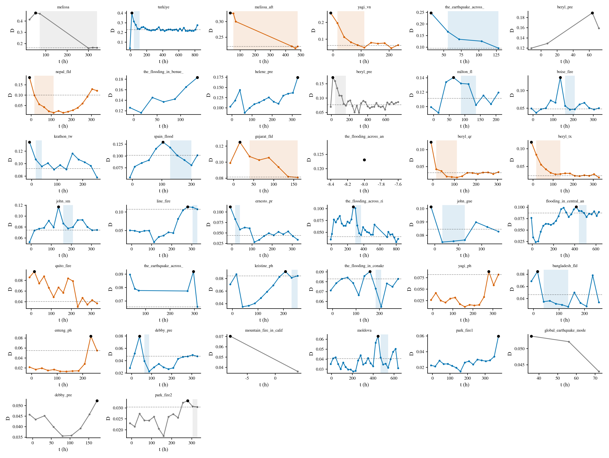
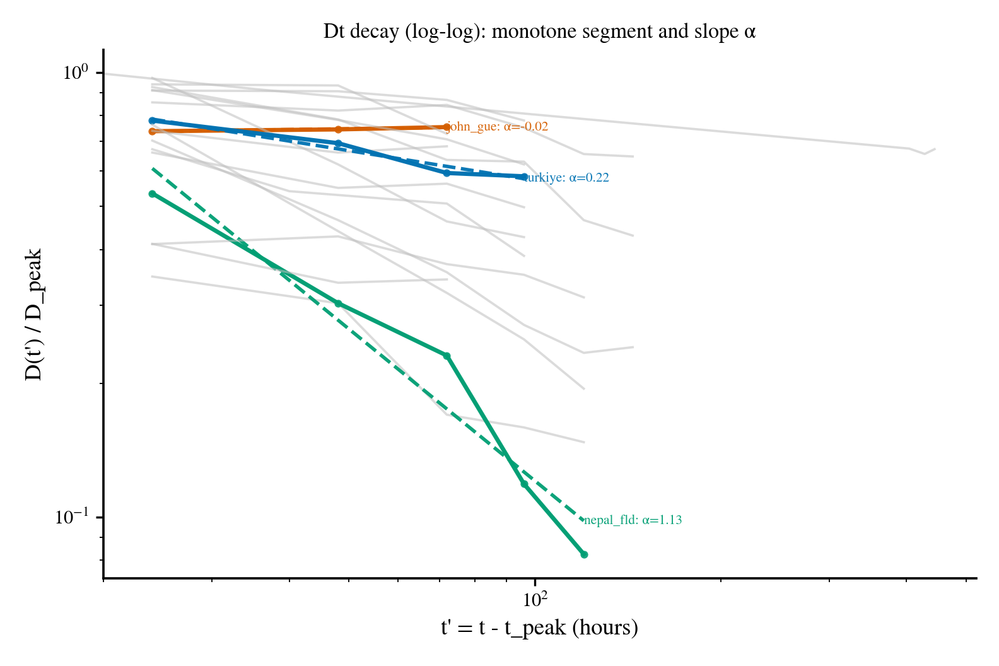
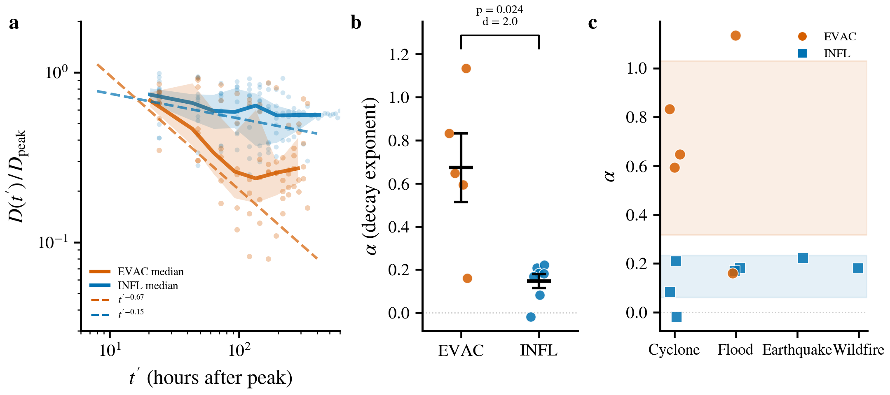
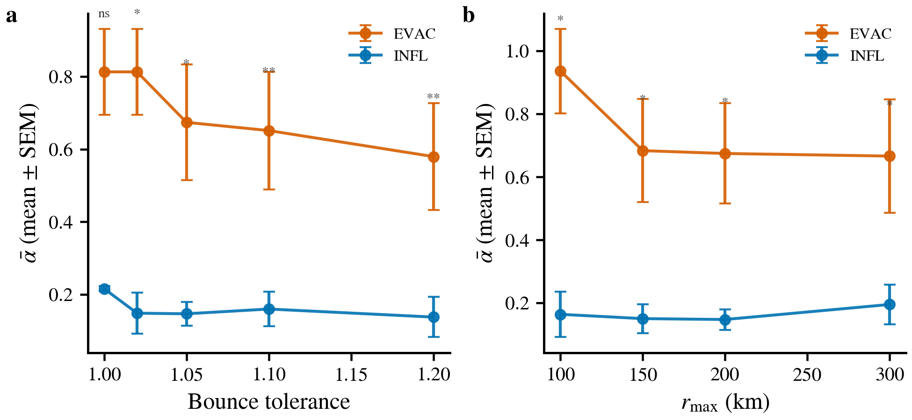
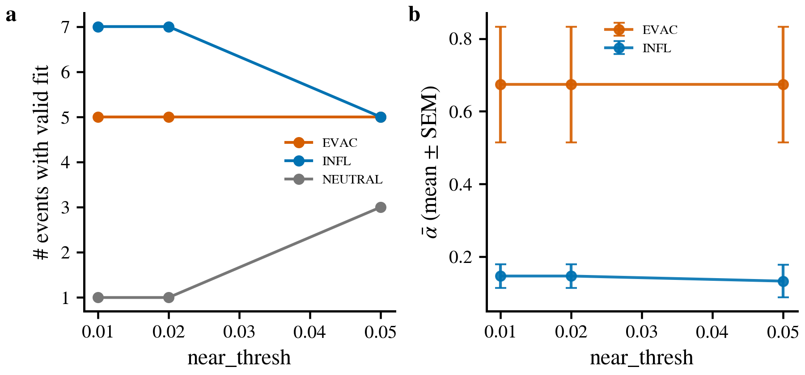

# 研究进展简报：灾害后人口恢复的幂律动力学

> **写给**：尚未参与分析细节的合作者  
> **目的**：从零构建分析框架，说清楚"我们发现了什么、为什么重要、接下来要做什么"  
> **阅读时间**：~15 分钟

---

## 问题：灾害后，人口多久恢复正常？

灾害对人口分布的冲击是暂时的——不管是飓风迫使人们撤离，还是地震引来救援力量，偏离正常的人口分布终将回落。但回落的速度差异巨大：有的灾害区域几天内就恢复正常，有的持续数周。

**什么因素决定了恢复的快慢？** 这就是我们要回答的核心科学问题。

为了回答它，我们需要三样东西：(1) 一个能量化"偏离正常程度"的指标，(2) 对这个指标的衰减行为做数学描述，(3) 找到预测衰减速度的变量。下面按这个顺序展开。

---

## 第一步：量化"偏离"——数据与指标

### 数据来源

我们使用 **Meta/Facebook Disaster Maps (FBDM)**。Meta 在灾害发生后激活数据采集，每 8 小时提供一个快照，报告每个空间 tile（约 2–5 km 分辨率）的：

- $n_{\text{crisis}}$：灾害期间该 tile 的人口（基于 Facebook 用户采样估计）
- $n_{\text{baseline}}$：该 tile 在正常时期的基线人口

### tile 级偏离

$$\delta(r, t) = \frac{n_{\text{crisis}}(r,t)}{n_{\text{baseline}}(r)} - 1$$

$\delta > 0$ 表示人口比平时多，$\delta < 0$ 表示人口比平时少。$r$ 是 tile 到灾害中心的距离。

### 全局扰动指标 D(t)

我们需要把散布在空间各处的 tile 级偏离压缩成一个"总扰动强度"随时间的曲线：

$$D(t) = \frac{1}{N_r} \sum_{r \leq 200\,\text{km}} |\delta(r,t)|$$

取绝对值是因为我们首先关心**扰动有多大**，而不是方向。D(t) 衡量的是"此刻人口分布离正常状态有多远"。

### 所有事件的 D(t) 时间序列

所有事件呈现同一个模式：灾害发生 → D 上升到峰值 $D_{\text{peak}}$ → 随后衰减。但衰减速度差异显著——有的陡峭地下降，有的长时间维持在高位。

**自然引出的问题**：这个衰减遵循什么数学规律？速度差异能被预测吗？

---

## 第二步：衰减的数学形式——幂律

### 模型选择

我们对每个事件的峰后衰减段拟合三种候选模型，用 BIC（贝叶斯信息准则，越低越好）选最优：

| 模型 | 形式 | 直觉 |
|---|---|---|
| 幂律 | $D/D_{\text{peak}} \sim t'^{-\alpha}$ | 衰减逐渐变慢（多时间尺度叠加）|
| 指数 | $D/D_{\text{peak}} \sim e^{-t'/\tau}$ | 恒定速率衰减（单一时间尺度）|
| 拉伸指数 | $D/D_{\text{peak}} \sim e^{-(t'/\tau)^\beta}$ | 衰减速率随时间变化 |

这里 $t' = t - t_{\text{peak}}$ 是峰后时间。

### 结果：幂律是主导的衰减形式

在 16 个有足够衰减数据（峰后 ≥ 3 步单调下降）的事件中，**12 个的 BIC 最优模型是幂律**。

下面是所有事件峰后标准化衰减曲线的 log-log 图：

**诚实说明**：原始曲线包含明显的锯齿和非单调波动——这是 8 小时采样窗口 + 有限空间覆盖导致的噪声，而非信号。我们的拟合策略是：先提取峰后最长的**连续单调下降段**（容许 5% 的微小反弹），然后在这个段上做 log-log 线性回归。BIC 模型比较也是在这个清洗后的衰减段上进行的。

也就是说，"幂律是最优模型"这个结论不是基于视觉上的直线判断，而是基于**三种模型的定量比较**：在 12/16 个事件中，幂律的 BIC 值最低（拟合质量与模型复杂度的最佳平衡）。4 个不服从幂律的事件被 BIC 标记为 exponential 或 stretched-exponential，它们被排除出后续的 α 比较分析——因为非幂律事件的 α 不具有可比性。

### 关键参数：α

幂律 $D \sim t'^{-\alpha}$ 中的 $\alpha$ 就是衰减速率：
- $\alpha$ 大 → 衰减快（恢复快）
- $\alpha$ 小 → 衰减慢（恢复慢）

**现在问题变成了：什么决定 α 的大小？**

---

## 第三步：核心发现——近场人口位移的方向预测衰减速率

### 一个"不 work"的直觉

最直觉的猜测是"灾害越大，恢复越慢"。我们检验了这个假设：

> $D_{\text{peak}}$（扰动幅度）与 $\alpha$ 的相关性：Spearman ρ = 0.510, p = 0.090 — **不显著**。

扰动幅度不能预测恢复速度。大灾不一定恢复慢，小灾不一定恢复快。

### 真正的预测变量：δ_near

回到 tile 级的 $\delta(r,t)$。在峰值时刻，看近场（$r$ 较小的区域）的 $\delta$ 均值：

$$\delta_{\text{near}} = \text{mean}(\delta(r, t_{\text{peak}})), \quad r \leq r_{\text{near}}$$

这是一个连续变量，不需要人为分类。它的物理含义直接来自测量值本身：

- $\delta_{\text{near}} < 0$：峰值时刻近场人口比平时少——人走了
- $\delta_{\text{near}} > 0$：峰值时刻近场人口比平时多——人来了

### α vs δ_near：连续的单调关系

下图是 12 个通过质量筛选的事件（当前版本使用旧的分类配色，后续将更新为按 δ_near 连续着色）：

| 指标 | 值 | 含义 |
|---|---|---|
| Spearman ρ | **−0.692** | 强负单调相关 |
| p 值 | **0.013** | 统计显著 |

**核心发现**：$\delta_{\text{near}}$ 越负（近场人口流失越多），$\alpha$ 越大（恢复越快）；$\delta_{\text{near}}$ 越正（近场人口涌入越多），$\alpha$ 越小（恢复越慢）。

换句话说：**决定恢复速度的不是灾害"打击有多大"，而是人口响应的方向**。

### 为什么是方向而非幅度？

这个结论初看反直觉，但可以这样理解：

- 当人**撤离**时，扰动在空间上是 coherent 的（近场统一减少）。这种结构简单的偏离，回归正常只需要"人回来"这一个过程，所以快。
- 当人**涌入**时，涌入可能来自多种来源、多种动机（救援队到达又撤离、媒体短暂停留、重建工人长期驻扎……），时间尺度各不相同。多时间尺度叠加的效果就是慢衰减——这恰好是幂律的物理机制之一。

> **注意**：以上是物理假说，尚未被直接验证。后续的空间分解实验（板块 D）将提供检验。

---

## 数据质量与筛选：为什么是 12 个事件

从 38 个灾害事件到 12 个最终分析样本的筛选流程：

| 阶段 | 标准 | 排除数 | 剩余 |
|---|---|---|---|
| 原始 | 全部 FBDM activation | — | 38 |
| ① | 时间窗口 ≥ 4 | 2 | 36 |
| ② | 峰后单调衰减段 ≥ 3 步 | 20 | 16 |
| ③ | δ_near 非 NaN | 1 | 15 |
| ④ | BIC 最优模型 = 幂律 | 3 | **12** |

每一步都是先验的方法学标准：
- ①②：数据量不够的不拟合
- ③：无法计算 δ_near 的不参与相关性分析
- ④：衰减本身不符合幂律的，其 α 没有可比性

**最大瓶颈在 ②**：20 个事件峰后没有足够的单调衰减段（0–2 步就反弹了）。这主要是因为 FBDM activation 的时间跨度太短——很多事件只有 7-10 个时间窗口，峰值出现在中后段，峰后根本没多少数据。

> 详细的筛选论证见 `Docs/data_quality_and_sample_selection.md`。

---

## 稳健性：换个标准还成立吗

我们测试了 6 种不同的筛选方案：

| 筛选方案 | n | Spearman ρ | p |
|---|---|---|---|
| 不筛选（n_mono ≥ 3） | 15 | −0.389 | 0.152 |
| t_start ≥ 24h | 13 | −0.714 | 0.006 |
| n_mono ≥ 4 | 10 | −0.648 | 0.043 |
| **BIC = power_law** | **12** | **−0.692** | **0.013** |
| BIC=PL + t ≥ 24h | 11 | −0.791 | 0.004 |
| n_mono ≥ 4 + t ≥ 24h | 9 | −0.700 | 0.036 |

5/6 种方案 p < 0.05。唯一不显著的是完全不做质量筛选——因为混入了 BIC 偏好非幂律的事件（其 α 本身没有可比性）。

---

## 当前状态与下一步

### 我们已经有的

1. 38 个灾害事件的完整 D(t) pipeline 和 BIC 模型比较
2. 核心发现：α vs δ_near 的显著负相关（方案 E，连续变量，无需分类）
3. 多方案稳健性验证
4. 数据质量文档

### 需要补充的实验（按叙事顺序）

| 优先级 | 实验 | 回答的问题 |
|---|---|---|
| **P0** | 更新核心散点图为连续着色（不用 EVAC/INFL 分类配色） | 与方案 E 的叙事一致 |
| **P0** | α vs D_peak 散点图 | 证明"幅度不预测速度"（重要的否定结果） |
| **P1** | BIC 模型比较可视化（ΔBIC bar chart） | 为筛选标准提供视觉证据 |
| **P1** | 筛选稳健性森林图（forest plot） | 回应 cherry-picking 质疑 |
| **P1** | Leave-one-out 敏感性分析 | 证明不依赖任何单一事件 |
| **P2** | α 与多变量的相关矩阵 | 排除混淆变量 |
| **P2** | 分距离带（near/mid/far）的 α 分析 | 快/慢衰减发生在哪个空间尺度 |
| **P2** | δ(r, t_peak) 空间轮廓 | 理解两类事件的空间结构差异 |

### 增加样本量的建议

当前最大瓶颈是 n_mono ≥ 3（38 → 16）。要增加有效样本，优先寻找：
- **时间跨度长**的 FBDM activation（≥ 15 个时间窗口）
- **峰值不在序列末尾**的事件（峰后至少还有 4-5 个窗口）
- 数据集 README 或 manifest 中通常能看到 n_time_windows 和日期范围，可以作为预筛选标准

---

## 一句话总结

**灾害人口扰动的峰后弛豫遵循幂律，而恢复快慢由近场人口位移的方向——而非扰动幅度——所决定。** 疏散型灾害恢复快，涌入型灾害恢复慢。这个发现跨越了飓风、地震、洪水、台风和野火 5 类灾害。
